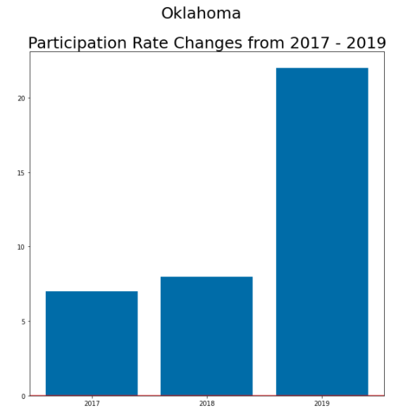

## Problem Statement 

After reconfiguring the SAT for 2016 to be more in line with the new standard of commone core, the College Board is now in the process of continuing to increase participation in test taking throughout the country. The goal is to determine what recommendations can be made to increase participation in the state of Oklahoma.

## Executive Summary

After importing the datasets for ACT and SAT for 2017, 2018, and 2019; I cleaned and corrected the data there were several errors in the each data set including incorrectly cased names of states, missing numerials on various scores, duplicate rows of states, and additional terroties that we did not want to include in the analysis. In addition I had to convert the participation rate columns of each set to be float values as opposed to strings. Lastly in order to merge all of the data into a single data set I needed to ensure that each column had unique anc concise names. 

After cleaning the data I was able to analyze the data. I used sorting to analyze which states highed the highest levels of partipations in each test for each year, as well as various outcomes of the scores. In analyzing the data I generated various histograms, scatterplots, and boxplots. I used the histograms to compare Participation rates, Math scores, and Reading/verbal scores for each test. The scatterplots were used to compare SAT vs. ACT math scores for 2017, SAT vs. ACT verbal/reading scores for 2017, SAT vs. ACT total/composite scores for 2017, Total scores for SAT 2017 vs. 2018, Composite scores for ACT 2017 vs. 2018. 

## Research

Ultimately I zeroed in on the disparity between the increase in particpation with the SAT and the decrease in participation with the ACT over the three year period. Outside research shows that the primary cause is due to competitiveness from SAT College Board on bidding for state contracts, as will as the implemention of the SAT School Day program which allows for students to take the test during school hours on school campuses. 
 

 

## Conclusions

Ideas for Expanding Participation. The primary focus should be continued focus of SAT School Day in rural part of Oklahoma and efforts with the State Board of Education regarding upcoming opportunities to bid for state testing contracts.

 - Localized lobbying efforts with municipalities and state governments to encourage participation and/or mandate.
 - Coordination with organizations on providing resources for test fees
 - Dedicated resources to assist with grants for local/state agencies to assist with test fees
  - Consider offering online/virtual proctored tests
  - Focus efforts on more rural areas

 - As participation increases,
 - Cost for implementation will increase
 - Mean test scores will decrease 
 - When expanding to rural areas,
 - There are less resources and opportunities for student prep
 
 Citations:
 
https://www.collegeboard.org/releases/2018/more-than-2-million-students-in-class-of-2018-took-sat-highest-ever

https://reports.collegeboard.org/sat-suite-program-results/class-2019-results

https://www.freep.com/story/news/local/michigan/2015/01/07/michigan-replaces-act-sat/21385299/

Acknowledgements:

Thanks to the following for providing feedback and mutual support Lydia Kajeckas, Haley Taft, Aidan Curley, James Pecore, Jenny James, David Lee, Eric Heidbreder, Dana Hackel.
