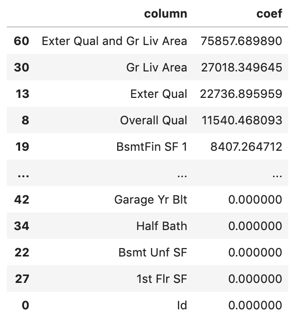
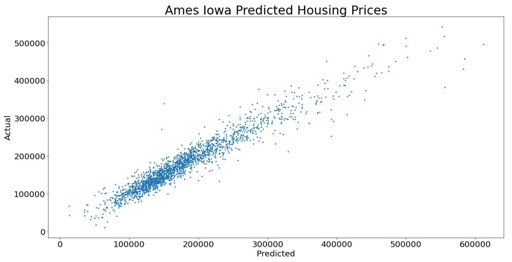
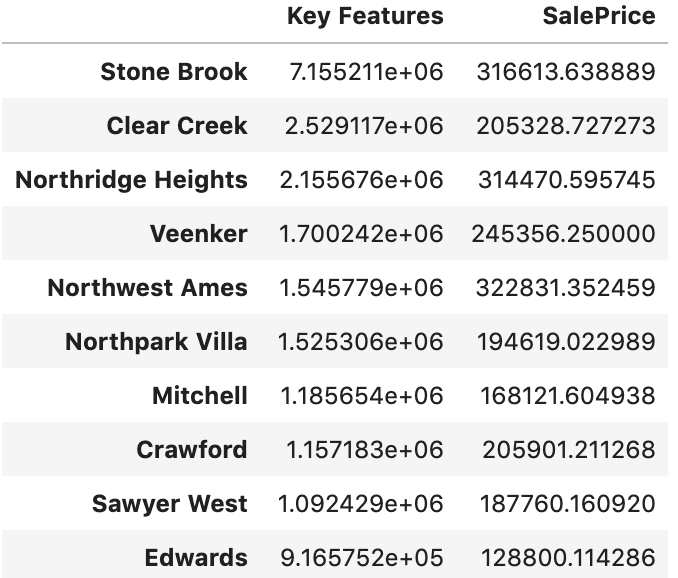
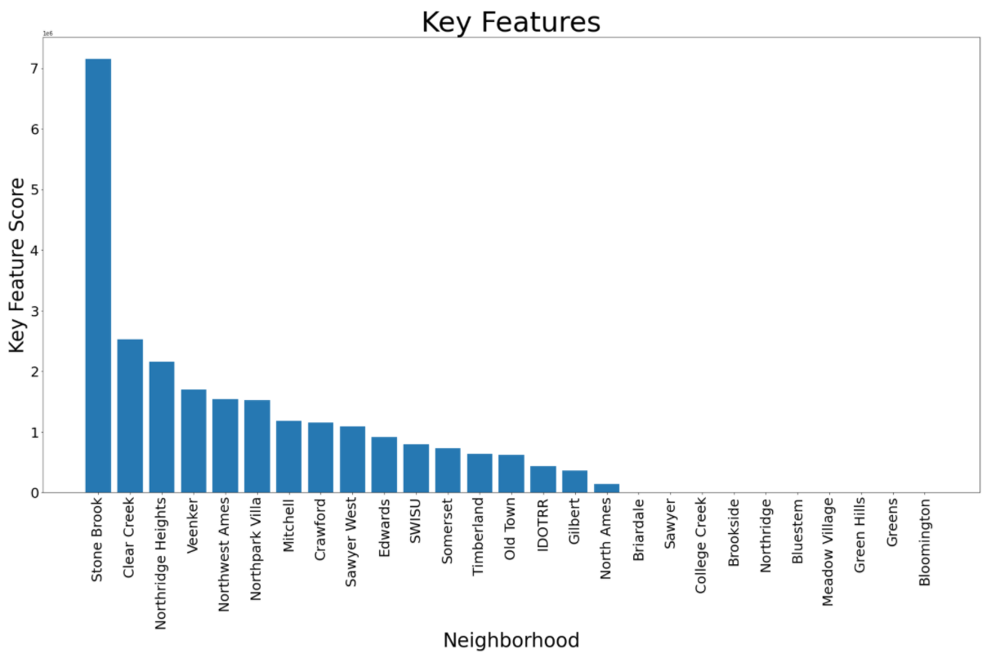

# A Model to Rank Neighborhoods by Key Features, and Provide Mean Sale Price

## Problem Statement

I have been asked to help a real estate agency produce a model which will accurately predict housing prices in their market, while at the same time creating a program that will take in key features provided by a client and generate a ranking of the neighborhoods in the market based on a score generated from the key features provided. For the purpose of this project I am using the Ames Iowa Dataset.

## Table of Contents

- [Project Directory](#projectdirectory)  
- [Executive Summary](#executivesummary)
- [EDA and Modeling](#edaandmodeling)

  
## Executive Summary
The first part of my project involved working with the dataset provided to me by the real estate agency. This data consisted of over 2,000 homesales, with 80 features associated with each home. These features consisted of multiple types including nominal, ordinal, continuous and discrete. Some of the features were specific to the property and did not necasarrilly contribute to the outcomes of the project, such as property ID information. I completed the process of cleaning and organizing the data properly; making sure to account for missing values appropriately by the type of feature it represented. I also took the opportunity to reassign numeric values to some of the ordinal features so that they can be better used for our modeling. To make my cleaning process more efficeint I created a function which would output all of the unique values and value counts for each feature column. This would allow me to compare how many nan values there are for each feature and see how the values are distributed for each feature. This prevented me from having to review the unique values and value counts for each of the 80 features.

With clean and organized data that can be properly utilized, I will be able to accurately predict housing prices, and generate neighborhood rankings as requested.

 
## EDA and Modeling
The biggest part of the project consisted of reviewing the data to see which features were most appropriate to be used. During this process is where I ran various pairplots, histograms, and scatter plots to see how the features were distributed and coorelated with one another. I ultimately decided to hot-one encode (dummify) four specific features; Zoning, Lot Configuration, House Style, and Garage Type. After creating the dummy columns I then ran a LASSO model to determine the cooefficeint of each feature as it relates to Sale Price. From this I decided to create "feature" columns by combining the values of Exterior Quality and Ground Living Area; and a second feature column with Overall Quality and Finished Basement Square Footage. By using these new dummy and feature columns I was able to create a linear regression model which accurately predicted the housing price within $22,000 of the actual price.

  

  

## Ranking Neighborhoods
Once I was able to successfully predict housing prices, I moved on to the second part of the project to begin building a program to ranking neighborhoods by a Key Feature Score. In preparation for this I one-hot encoded (dummified) the neighborhood feature so that we could use each of the neighborhoods. I then created a smaller dataframe to include only the neighborhoods and a small selection of features. To make visual use of the dataframes I created a function that would generate the mean of a given feature and produce a chart for the feature by neighborhood. 

The culmination of the project was the creation of a function that would take in a given dataframe, the features from a client, and a scale if needed. In the function the key feature scores is created by multiplying the features provided (we might apply a scale here which would simply divided the product by a certain amount). The key feature scores are then passed to a dictionary which is used to create a dataframe along with the mean sale price for the neighborhood. The final output is the dataframe sorted by key feature score. I also created a function to generated a barchart for these rankings to be used.

  

  

## Conclusions and Next Steps
In the above example images the hypothetical client provided Ground Living Area, Lot Area, and Number of Full Bathrooms as their three key features. From this you can see that Stone Brook is the highest scoring neighborhood with a mean price of $316,613; while Clear Creek comes in second with the key features score with a mean price of $205,328. With this information hopefully the real estate agency and the client can make a more informed decision.

I hope to be able to adapt this product to be able to take input directly from a user and generate the results as presented. I also want to ensure that I can utilize the same model/program across multiple datasets.

## Special Thanks
Special thanks to Aidan Curley, Haley Taft, David Lee, Lydia Kajeckas, and Eric Heidbreder.